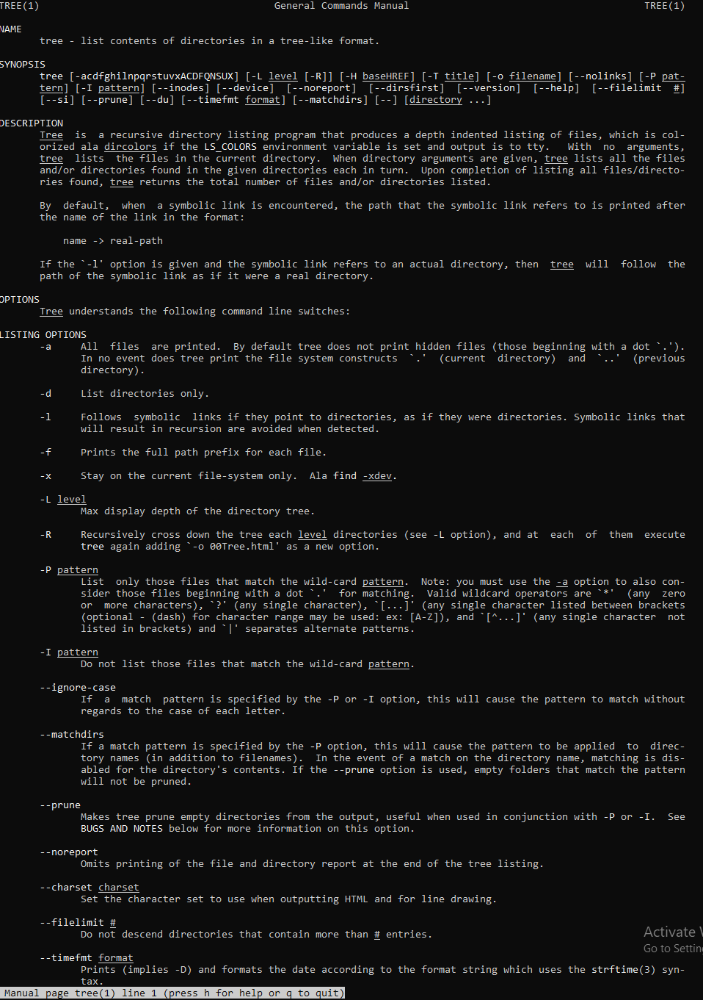

# Lab 01 Report - Introduction to Open Source Software
## Discord screenshot:

## Reading assignments:
The open source criteria are important because if there are restrictions on what someone can do with open source, then that will stifle innovation and creativity.

Another way to answer questions in a helpful way is to point the asker in the right direction, so they can ultimately solve it on their own instead of just copying and pasting the code the answer provides. Also, spend the time to make sure that the answer actually works and wouldn't introduce unknown bugs and problems with the asker's project.

What I got from reading Jesse's story is that people should be able to tinker with software that is non-profit and without any malicious intent and not have to face lawsuits. It also made me realize how predatory the music/film industries can be. The hypocrisy of this industry for going after a student instead of a large company like Google, which almost definitely had illegal files/sites indexed, was also revealed. This sort of predatory copyright protection can also stifle technological innovation. With open source, this issue can somewhat be solved because there is no owner of the software, it is owned by everyone and the contributors shouldn't be liable for what the users do with that software. Although, there may still be predatory attempts to shut down the main contributors of these problems. There are many cases where people make software that then can be misused for illegal purposes. In these cases, the users of the software that do illegal things should be in trouble, not the creators. 

## Tree:

## Regex:

## Regex Puzzles:

## Blockly:

## Reflection:
