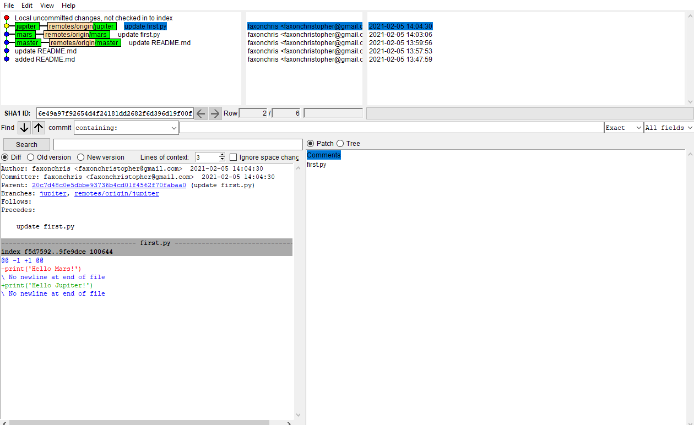
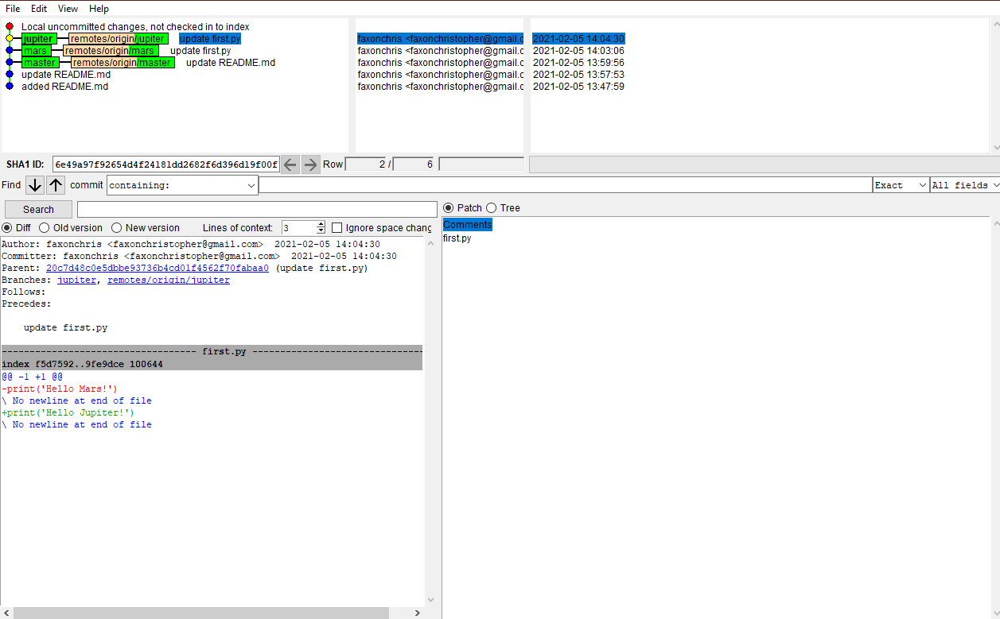
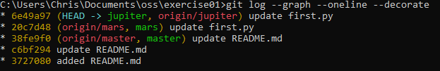
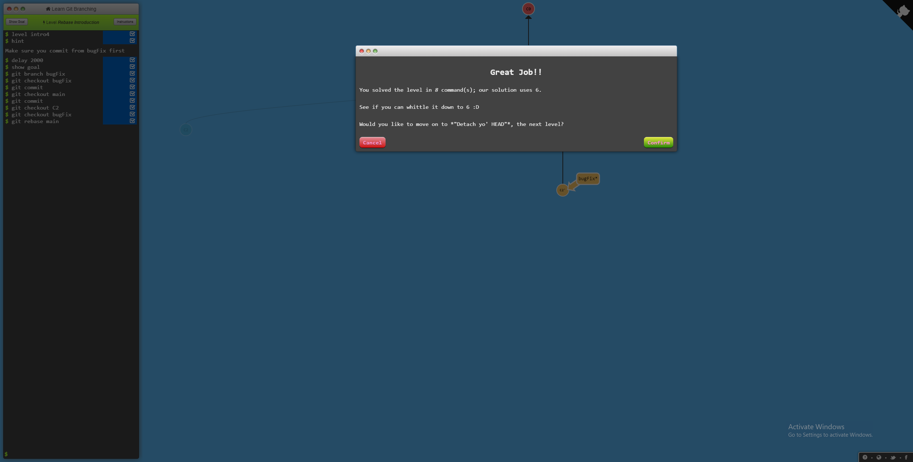

https://github.com/rcos/CSCI-4470-OpenSource/blob/master/Modules/02.Git/Lab-Git.md

lab 2 part 1: 
https://github.com/faxonchris/lab2part1

lab2 part 2: 
https://github.com/faxonchris/Spoon-Knife

lab3 part 3:
https://github.com/0NotApplicable0/OSSProjectIdeas/tree/master/Spring2021

* 
* 
* 
* 
