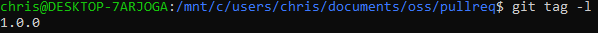

https://github.com/rcos/CSCI-4470-OpenSource/blob/master/Modules/02.Git/Lab-Git.md

lab 2 part 1: 
https://github.com/faxonchris/lab2part1
* 
* 
* 

lab2 part 2: 
https://github.com/faxonchris/Spoon-Knife
* 

lab2 part 3:
* 
* 
https://github.com/0NotApplicable0/OSSProjectIdeas/tree/master/Spring2021