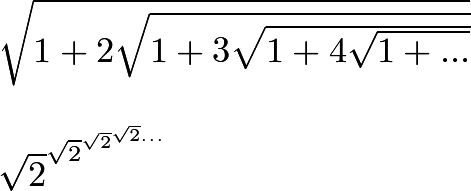
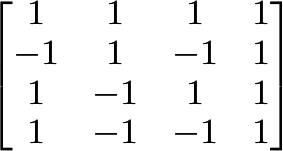
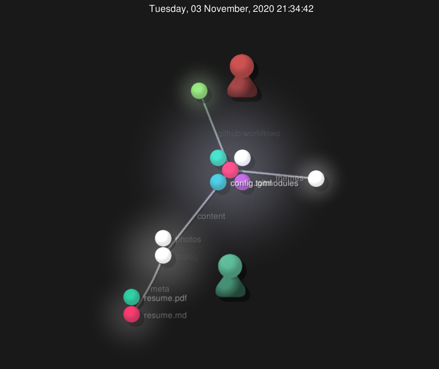
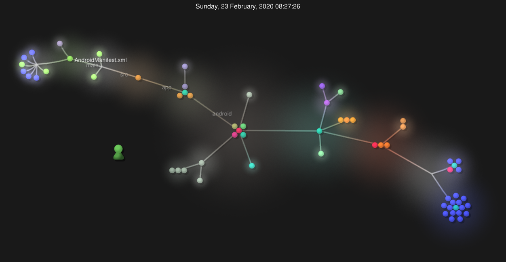
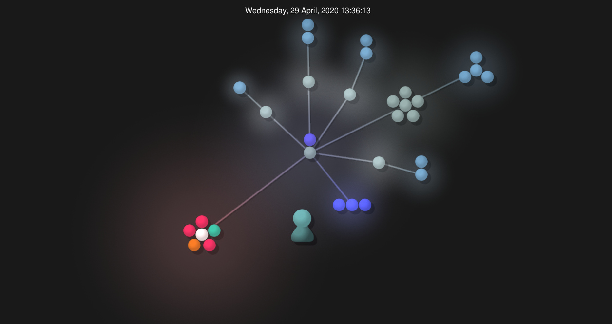
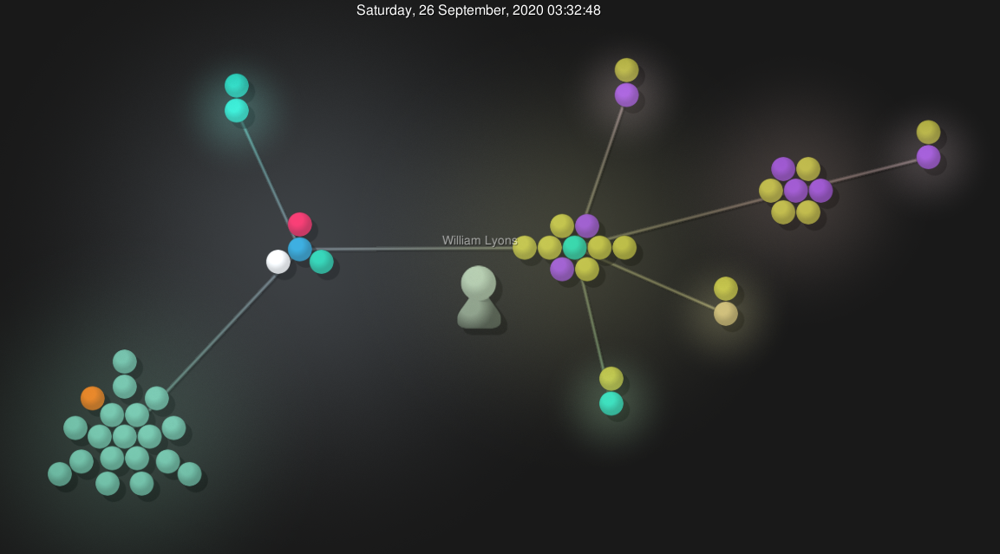

# Lab 3 Report - Introduction to Open Source Software

$\sqrt{1 + 2 \sqrt{1 + 3 \sqrt{1 + 4 \sqrt{1 + ...}}}}$

$\sqrt{2}^{\sqrt{2}^{\sqrt{2} ^ {\sqrt{2} ...}}}$

## Resulting screenshot:

## Hadamard Matrix size 4:

## RCOS analysis:

### onmyownti.me

contributors: 1

lines of code: 2251

first commit: "Initial commit" https://github.com/omot/onmyownti.me/commit/71a5be1c6422e8fe7a4467be5b58724a0cdcaae3

latest commit: "updated theme to fix font" https://github.com/omot/onmyownti.me/commit/f8656e4ad6fbd35cb03b01897c5d03b9ad3d59d3

current branches: "main", "preview"

### Flutter ShuttleTracker

Number of branches: 13

Number of contributors: 5

Lines of code: 37461

First commit: Initial commit (3e7e97dfa70dc480a5a68b7ff70a8575bd93af50)

Latest Commit: Commented Code and Documentation of the settings_page directory (63400bcc58b3dd0fdb4c626b56c04e3c242b8397) On branch (eta_panel)

### MarketBot

Number of branches: 8

Number of contributors: 4

Lines of code: 2313

First commit: Initial commit (fa857b000c2c85ab167a19eb1b02ed26c16a891d)

Latest Commit: Retrying drop gitignore files (77b7b88c2c12b1d153f1f19893827aafdac2811b) On branch master

### Insomnia Dialogue System

the number of contributors: 3

number of lines of code: 85996 total

the first commit: commit 7d2dcb71edad3a3abdaf91b8ca8cd31a77752072 - "Initial Commit" on branch: master

the latest commit: commit e5ada154e210d1962f7912b9989713620822de51 - "Final Push. Horizontal Scroll rects and generating buttons is good to go" on branch: master

the current branches: just master

###Gitstats results:

###onmyownti.me

Gitstats found 1949 lines of code and 4 contributors, git found 2251 lines of code and 1 contributor

### Flutter ShuttleTracker

Gitstats found 18887 lines of code and 6 contributors, git command found 37461 lines of code and 5 contributors

### MarketBot

Gitstats found 2326 lines of code and 10 contributors, git command found 2313 lines of code and 4 contributors

### Insomnia Dialogue System

Gitstats found 30634 lines of code and 3 contributors, git command found 85996 lines of code and 4 contributors

### onmyownti.me gource:

### Flutter ShuttleTracker gource:

### MarketBot gource:

### Insomnia Dialogue System gource:
