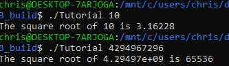

# Lab 5 Report - Introduction to Open Source Software

## Step 1 output:

CMakeLists: https://github.com/faxonchris/oss-repo-template/blob/master/labs/lab-05/Step1/CMakeLists.txt

## Step 2 output:

CMakeLists: https://github.com/faxonchris/oss-repo-template/blob/master/labs/lab-05/Step2/CMakeLists.txt

## Step 3 output:

CMakeLists: https://github.com/faxonchris/oss-repo-template/blob/master/labs/lab-05/Step3/CMakeLists.txt

MathFunctions/CMakeLists: https://github.com/faxonchris/oss-repo-template/blob/master/labs/lab-05/Step3/MathFunctions/CMakeLists.txt

## Step 4 output:

CMakeLists: https://github.com/faxonchris/oss-repo-template/blob/master/labs/lab-05/Step4/CMakeLists.txt

MathFunctions/CMakeLists: https://github.com/faxonchris/oss-repo-template/blob/master/labs/lab-05/Step4/MathFunctions/CMakeLists.txt

## Step 5 output:

CMakeLists: https://github.com/faxonchris/oss-repo-template/blob/master/labs/lab-05/Step5/CMakeLists.txt

MathFunctions/CMakeLists: https://github.com/faxonchris/oss-repo-template/blob/master/labs/lab-05/Step5/MathFunctions/CMakeLists.txt

## Static library then dynamic library results:

CMakeLists: https://github.com/faxonchris/oss-repo-template/blob/master/labs/lab-05/Lab-BuildSystemsExample/CMakeLists.txt

MakeFile: https://github.com/faxonchris/oss-repo-template/blob/master/labs/lab-05/Lab-BuildSystemsExample/build/Makefile

## Size comparison:

Static linking: 8464

Dynamic linking: 8296